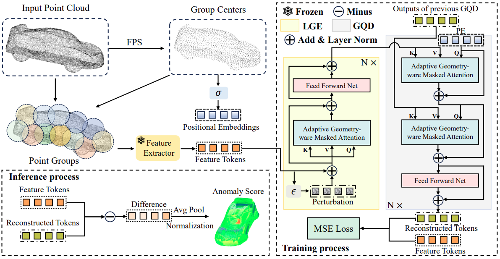

# MC3D-AD
Official PyTorch Implementation of [MC3D-AD: A Unified Geometry-aware Reconstruction Model for Multi-category
3D Anomaly Detection](https://arxiv.org/abs/2505.01969). Accepted by IJCAI 2025.



## 1. Quick Start

### 1.1 Requirements
- **Conda virtual environment creation**
```
conda create -n MC3D-AD python=3.8
conda activate MC3D-AD
pip install -r requirements.txt
pip install "git+https://github.com/erikwijmans/Pointnet2_PyTorch.git#egg=pointnet2_ops&subdirectory=pointnet2_ops_lib"
pip install --upgrade https://github.com/unlimblue/KNN_CUDA/releases/download/0.2/KNN_CUDA-0.2-py3-none-any.whl
```

- **Download feature extractor pre-trained weights.**
Point-MAE pre-trained weights can be downloaded [here](https://github.com/Pang-Yatian/Point-MAE/releases/download/main/modelnet_8k.pth). After downloading, place the `modelnet_8k.pth` file in the `./pretrain_ckp` directory

### 1.2 Real3D-AD

- **How to get the Real3D-AD dataset**. Download the Real3D-AD dataset from [here](https://drive.google.com/file/d/1oM4qjhlIMsQc_wiFIFIVBvuuR8nyk2k0/view?usp=sharing). After downloading, unzip it to the directory you specified.

- **Real3D Downsampling.** To simplify the training, you first need to downsampling the training set of Real3D. You can use the following command:
`
python downsample_pcd.py --radl3d_path <Path/to/your/Real3D-AD-PCD>
`
After the above operations are completed, the `real3D_down` directory will be created in the same directory layer as `Real3D-AD-PCD`.
- **cd the experiment directory** by running `cd ./experiments/real3d/`. 

- **Modify the config.yaml.** Please set the `dataset.data_dir` and `net.data_dir` of `config.yaml` to load the absolute path of your real3D_down.

- **Train or eval** by running: 

    `sh train.sh 1 #GPU_ID` or `sh eval.sh #1 #GPU_ID`.

    **Note**: Multi-gpu training is not currently supported. During eval, please *set the saver.load_path of config.yaml* to load the checkpoints. 

### 1.3 Anomaly-ShapeNet

- **How to get the Anomaly-ShapeNet dataset.** Download the Anomaly-ShapeNet dataset from [here](https://huggingface.co/datasets/Chopper233/Anomaly-ShapeNet). After downloading, unzip it to the directory you specified. Take out Anomaly-ShapeNet-v2/dataset/pcd and organize it into the following format:
```
Anomaly-shapeNet
├── ashtray0
    ├── train
        ├── *template.pcd
        ...
    ├── test
        ├── 1_bulge.pcd
        ├── 2_concavity.pcd
        ...
    ├── GT
        ├── 1_bulge.txt
        ├── 2_sink.txt
        ... 
├── bag0
...
```
- **Anomaly-ShapeNet dataset setting.** Please change the name of the `pcd` directory to `Anomaly-shapeNet` and fill the absolute path of the `Anomaly-shapeNet` into `dataset.data_dir` and `net.data_dir` in `./experiments/Anomaly-ShapeNet/config.yaml`.


- **cd the experiment directory** by running `cd ./experiments/Anomaly-ShapeNet/`.

- **Train or eval** by running: 

    `sh train.sh 1 #GPU_ID` or `sh eval.sh 1 #GPU_ID`.


    **Note**: During eval, please *set config.saver.load_path* to load the checkpoints. 

## Acknowledgement

Our work is inspired by [UniAD](https://github.com/zhiyuanyou/UniAD) , [Reg3D-AD](https://github.com/M-3LAB/Real3D-AD) and [IMRNet](https://openaccess.thecvf.com/content/CVPR2024/html/Li_Towards_Scalable_3D_Anomaly_Detection_and_Localization_A_Benchmark_via_CVPR_2024_paper.html), thanks their extraordinary works!
